# 🇮🇳 SevaBot: Voice-First Government Service Agent


> **Empowering citizens with voice-native access to government welfare schemes.**

---

## 📖 Overview

**SevaBot** is an intelligent, voice-first AI agent designed to bridge the digital divide for Indian citizens. It allows users to speak naturally in their native language (Hindi/English) to discover, understand, and interact with complex government schemes.

Powered by **Google Gemini 1.5 Flash**, SevaBot uses agentic reasoning to understand intent, search a real-time scheme database, and provide verified answers via synthesized speech.

---

## ✨ Key Features

- **🗣️ Voice-First Interface**:
  - Speak naturally in Hindi or English.
  - No typing required—perfect for semi-literate users.
  - "Glowing Orb" UI visualizes listening, thinking, and speaking states.

- **🧠 Agentic Reasoning**:
  - Uses the **ReAct (Reasoning + Acting)** pattern.
  - Dynamically plans steps: *Search DB -> Verify Eligibility -> Answer*.
  - Displays real-time "Thought Trace" for transparency.

- **🛠️ Powerful Toolbelt**:
  - **Scheme Database**: Searchable registry of welfare schemes (e.g., PM-KISAN, Ayushman Bharat).
  - **Eligibility Engine**: Verifies user criteria against scheme rules.

- **⚡ Modern Tech Stack**:
  - **Frontend**: React, Vite, TailwindCSS, Framer Motion (Glassmorphism UI).
  - **Backend**: Python FastAPI, Google Gemini API, gTTS.
  - **Deployment**: Docker-ready, deployable on Render/Vercel.

---

## 🏗️ Architecture

The system follows a modular client-server architecture:

```mermaid
graph LR
    User[🗣️ User] <-->|Voice/Audio| Frontend[React + Vite]
    Frontend <-->|JSON/REST| Backend[FastAPI]
    Backend <-->|API| LLM[Gemini 1.5 Flash]
    Backend <-->|Query| DB[(Scheme Database)]
```



*See [architecture.md](./architecture.md) for detailed design docs.*

---

## 🚀 Getting Started

### Prerequisites
- Node.js (v18+)
- Python (v3.9+)
- Google Gemini API Key

### Installation

1.  **Clone the Repository**
    ```bash
    git clone https://github.com/yourusername/sevabot.git
    cd sevabot
    ```

2.  **Backend Setup**
    ```bash
    cd backend
    python -m venv venv
    # Windows:
    .\venv\Scripts\activate
    # Mac/Linux: source venv/bin/activate
    
    pip install -r requirements.txt
    
    # Create .env file
    echo "GEMINI_API_KEY=your_key_here" > .env
    ```

3.  **Frontend Setup**
    ```bash
    cd ../frontend
    npm install
    ```

### Running the App

1.  **Start Backend** (Terminal 1)
    ```bash
    cd backend
    uvicorn main:app --reload
    ```

2.  **Start Frontend** (Terminal 2)
    ```bash
    cd frontend
    npm run dev
    ```

3.  Open `http://localhost:5173` and click the orb! 🔮

---

## 📂 Project Structure

```bash
sevabot/
├── backend/            # FastAPI Server
│   ├── agent.py        # ReAct Agent Logic
│   ├── main.py         # API Endpoints
│   └── tools.py        # Scheme Tools
├── frontend/           # React UI
│   ├── src/components  # UI Components
│   └── render.yaml     # Deployment Config
└── ...
```

---

## 🖼️ Gallery

*(Add screenshots of your Glassmorphic UI here)*

---

## 🤝 Contributing

Contributions are welcome! Please read `CONTRIBUTING.md` for details on our code of conduct, and the process for submitting pull requests.

## 📄 License

This project is licensed under the MIT License - see the `LICENSE` file for details.
